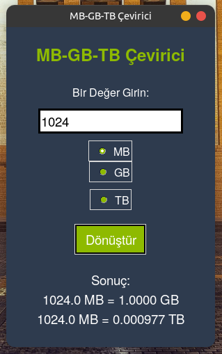

# MB-GB-TB-Converter

Computer Unit Converter MB-GB-TB Conversion Processes are Written in Python Language. Works Cross Platform (Windows-MacOS-Linux) TKinder Library is used.


Install Git Clone and Python3

Github Package Must Be Installed On Your Device.
```bash
sudo apt install git -y
```

```bash
sudo apt install python3 -y  && sudo apt-get install python3-tk -y


```

----------------------------------
https://fatihonder.org.tr/python-ile-deprem-veri-okuyucu/

# Installation
Install MB-GB-TB-Converter

```bash
sudo git clone https://github.com/cektor/MB-GB-TB-Converter.git
```
```bash
cd MB-GB-TB-Converter/
```

```bash
python bytsconvert.py
```
or

```bash
python3 bytsconvert.py
```

# Screenshot

 
