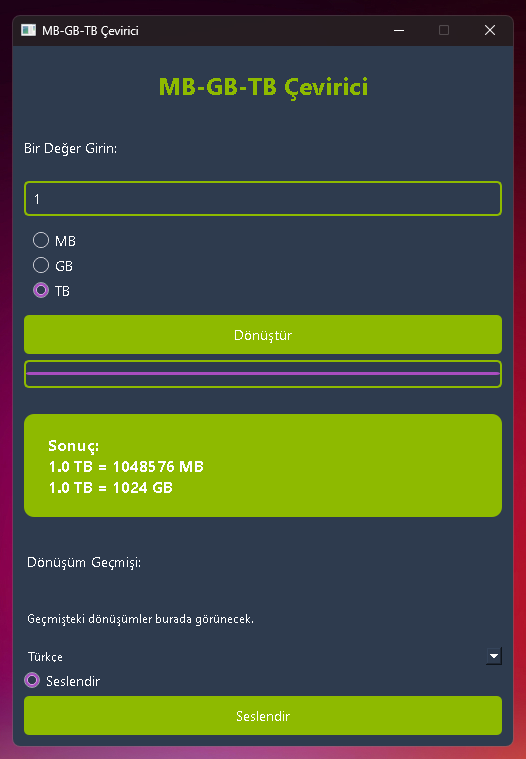

<a href="#">
    
</a>

# MB-GB-TB-Converter

Computer Unit Converter MB-GB-TB Conversion Processes are Written in Python Language. Works Cross Platform (Windows-MacOS-Linux) PyQt6 Library is used.


Install Git Clone and Python3

Github Package Must Be Installed On Your Device.
```bash
sudo apt install git -y
```

```bash
sudo apt install python3 -y 

```

# Required Libraries

PyQt6
```bash
pip install PyQt6
```
pyttsx3
```bash
pip install pyttsx3
```
matplotlib
```bash
pip install matplotlib
```


----------------------------------
https://fatihonder.org.tr/python-ile-mb-gb-tb-cevirici-yapimi/

# Installation
Install MB-GB-TB-Converter

```bash
sudo git clone https://github.com/cektor/MB-GB-TB-Converter.git
```
```bash
cd MB-GB-TB-Converter/
```

```bash
python bytsconvert.py
```
or

```bash
python3 bytsconvert.py

```

# To compile

NOTE: For Compilation Process pyinstaller must be installed. To Install If Not Installed.

pip install pyinstaller 

Linux Terminal 
```bash
pyinstaller --onefile --windowed bytsconvert.py
```

Windows VSCode Terminal 
```bash
pyinstaller --onefile --noconsole bytsconvert.py
```

MacOS VSCode Terminal 
```bash
pyinstaller --onefile --noconsole bytsconvert.py
```

# To run directly on Windows or Linux
Download and Run According to Your Operating System from the Link

https://github.com/cektor/MB-GB-TB-Converter/releases/tag/v1.0


# Linux Screenshot

 

# Windows Screenshot

 
